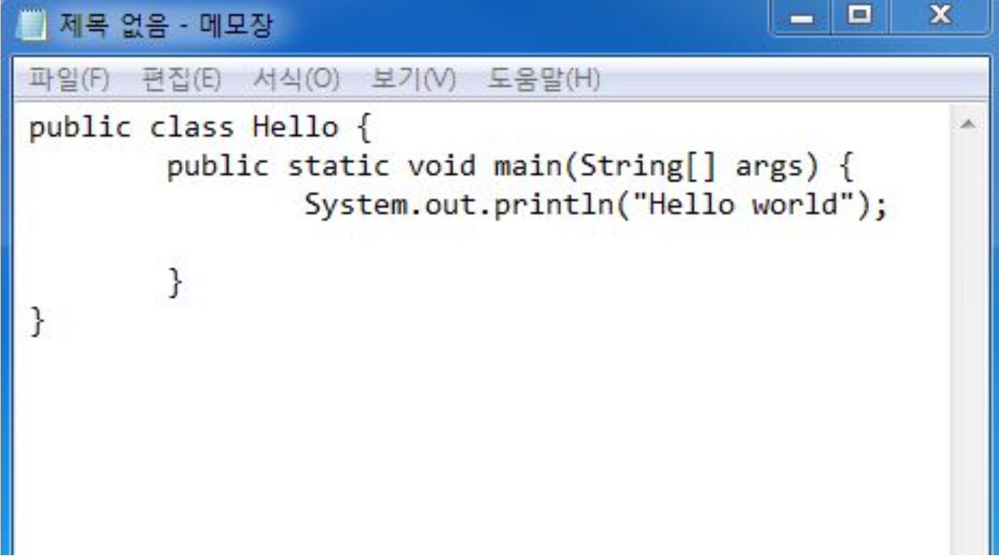
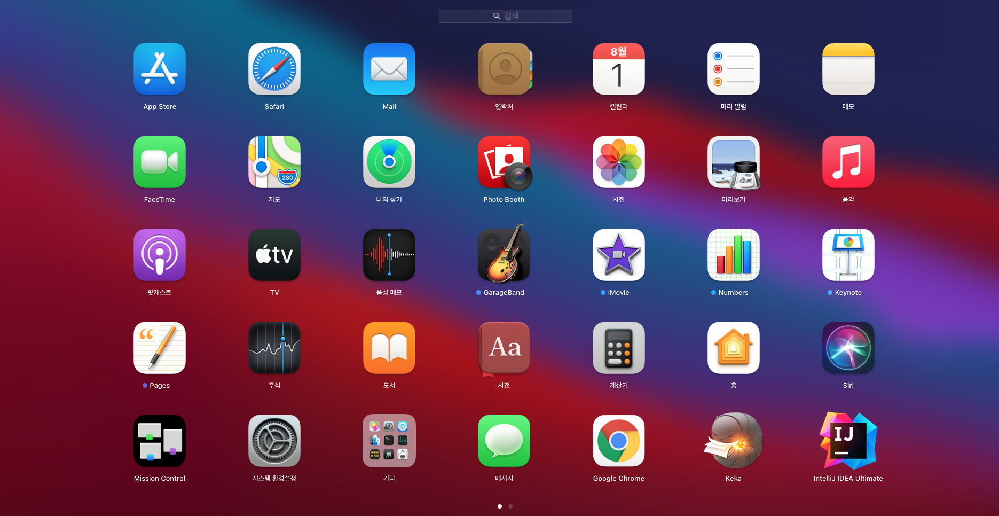
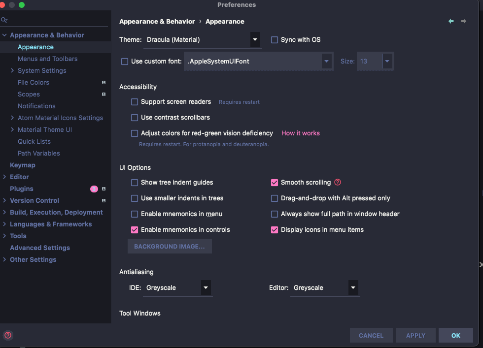

# 인텔리제이 설치하기

## 1. 통합개발환경(IDE)를 써야하는 이유

- Eclisple
- Visual Studio Code
- IntelliJ

## 그런데 그중에서 왜 인텔리제이를 쓸까?

- 단축키, 디버깅, 테스트, 자동완성 등등
- git과의 연동이 편이
- 예쁜 UI

> 단, 회사마다 사용하는 IDE가 다르므로 고루고루 친숙해져야 한다.

## 설치 방법

 
 
 * 다음과 같은 url에 접속 후 자신에게 맞는 os운영체제를 다운로드 받는다.
 * 커뮤니티 버전과 얼티메이트 버전 2개로 나눠지는데 기호에 맞게 설치한다.
 * 나는 얼티메이트 버전을 다운로드 받았다.

> 얼테메이트 버전은 유로이므로 선택시 주의
> 또한 window 환경에서 인텔리제이 설치는 추가적으로 설츠를 해줘야 하는것이 있다.
> https://goddaehee.tistory.com/195 다음과 같은 블로그에서 확인이 가능

## 설치 완료 화면

## 테마 설정

> 나는 어두운 화면을 선호해서 Dracula 테마를 다운받아 선택했지만
> 테마는 본인이 원하는 테마로 선택헤도 무방할것 같다.
