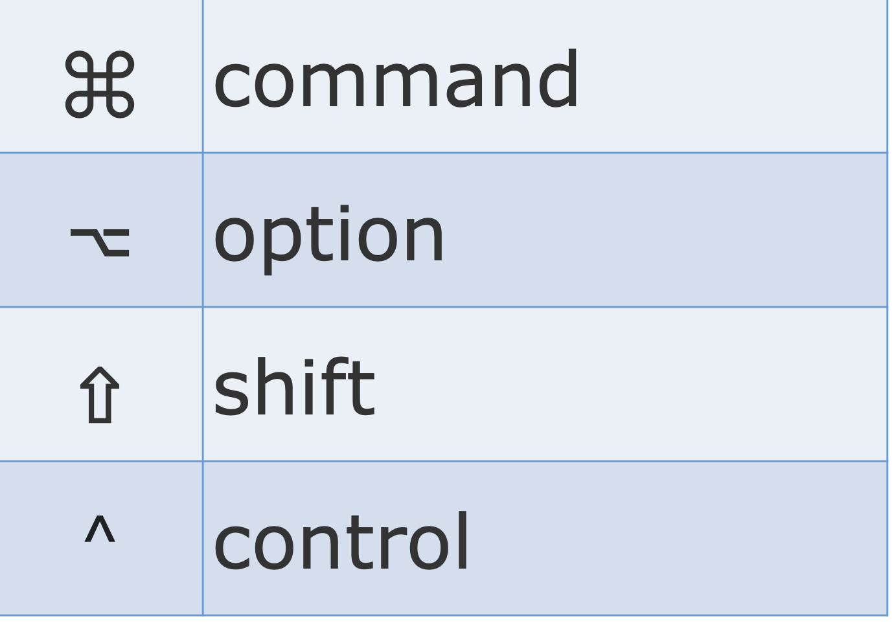
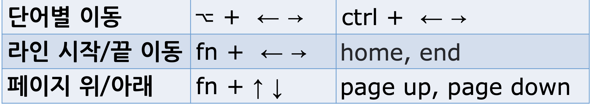
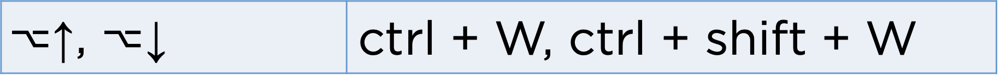
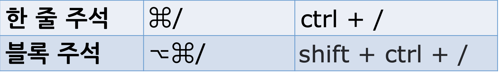
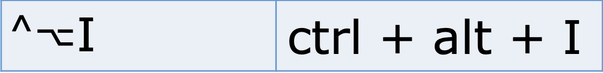
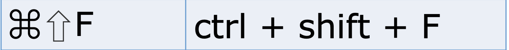

# 기본 단축키 1

## mac 키보드

## 프로젝트 창 포커스

## ESC

- 에디터 창으로 돌아오기

## Space

- 프로젝트 창 미리보기

## 에디터 창 키우기

## 에디터 창 이동

## 새 파일 생성

## 커서 이동

## 선택 확장 / 축소

## 주석 처리

## 인덴트 (들여쓰기)

## 자동 인덴트

## 사용처 찾기

## 파일 검색

## 경로 내 검색

## 전체 검색

## 최근 파일 열기

