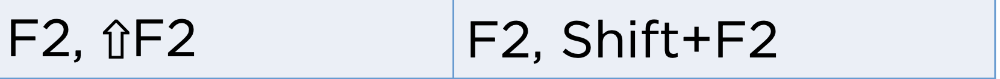
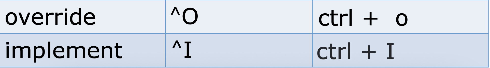
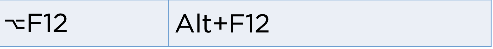
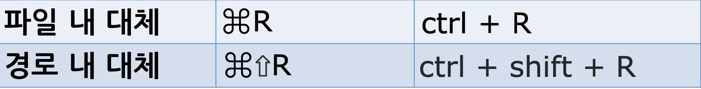
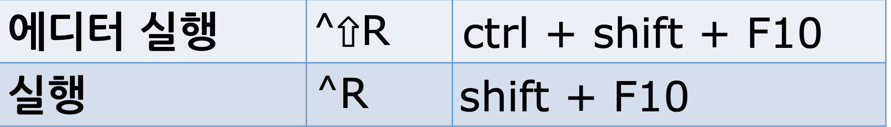
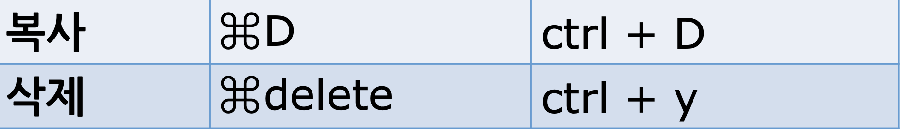
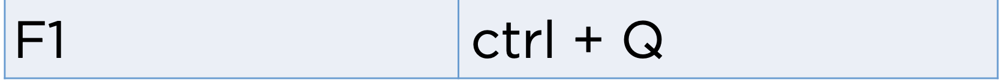
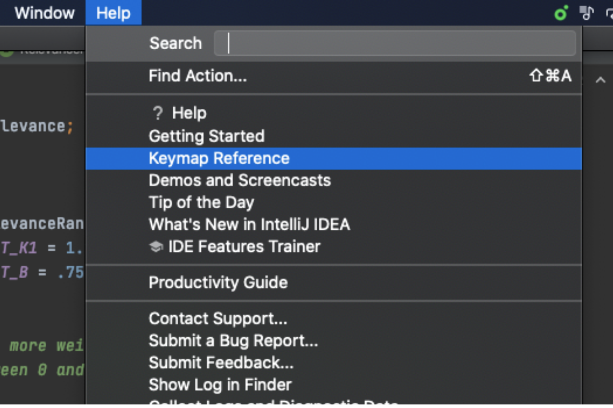

# 단축키 2

## Live Templete

- psvm
- sout
  

## 퀵 픽스

## 코드 이슈 별로 이동

## import 최적화

## 코드 생성

## 메소드 자동완성

## 터미널 창

## 구문완성

## 대체하기

## Run Anything

## 실행

## 종료

## 라인 수정

## 파라미터 정보

## Quick Definition

## Quick Document

## Java Doc

- 멀티 주석 /\*\* 를 입력하고 엔터치면 Java Doc 형식이 나온다.

## 기능(action) 찾기

## 주요 단축키

